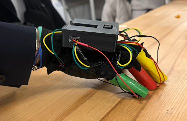
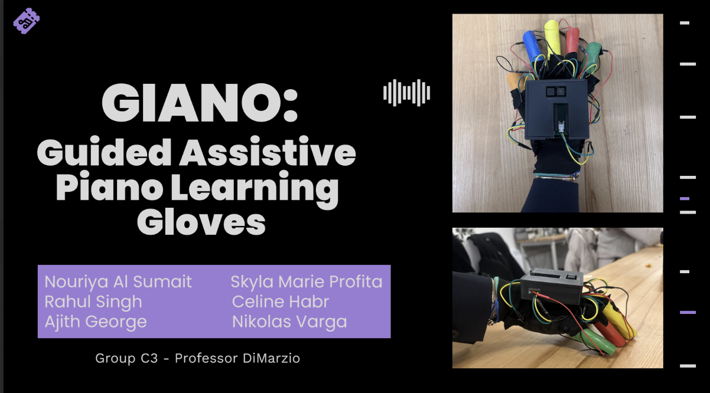
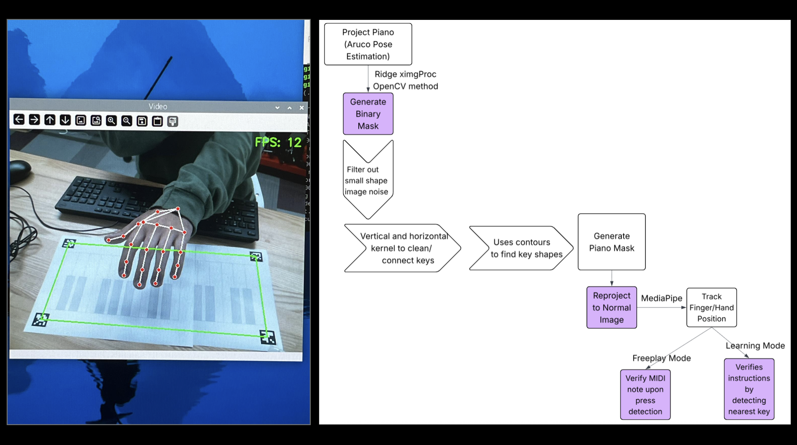
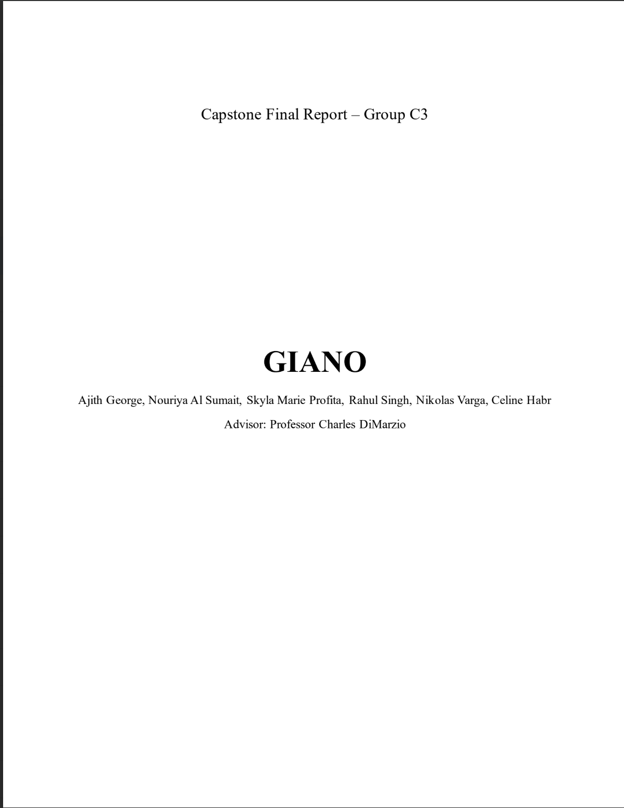
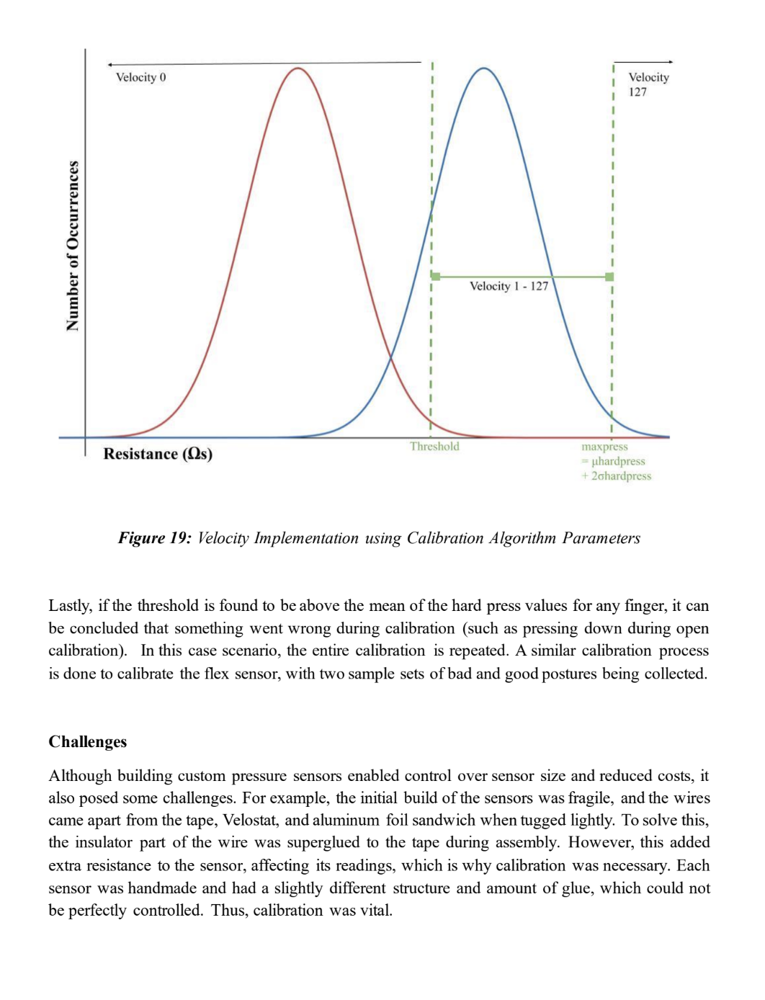
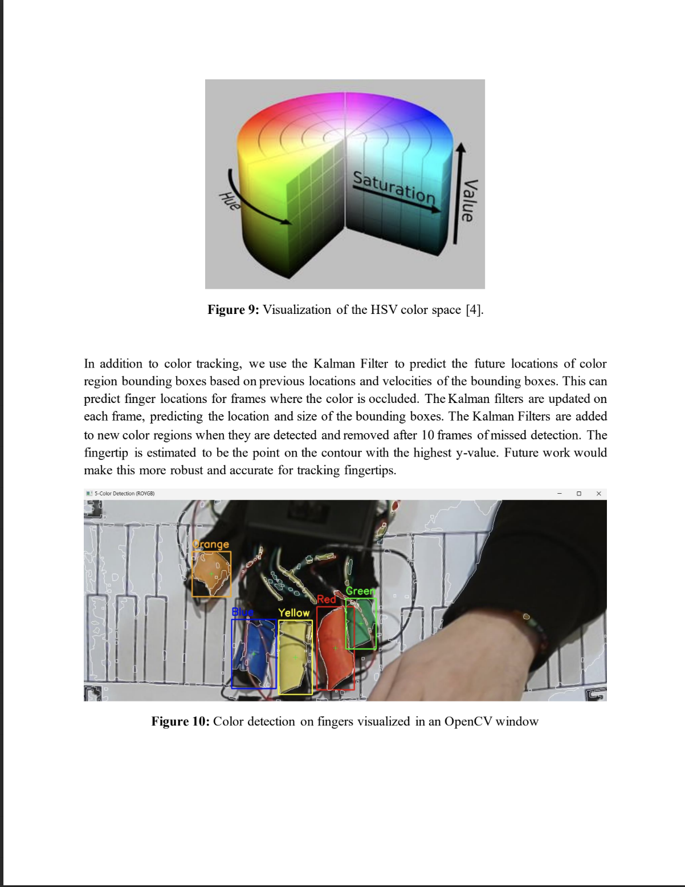

# 🎹 Giano - Guided Assisted Piano Learning System

<p align="center">
  
</p>

A comprehensive vision-free system for piano learning using computer vision, haptic feedback gloves, and audio synthesis. Created by Nouriya Al-Sumait, Ajith George, Celine Habr, Sky Profita, Rahul Singh, and Nikolas Varga for Northeastern University EEECE Capstone Design.


## ▶️ **Click below to watch the demo!**

<p align="center">
  <a href="https://www.youtube.com/watch?v=8nvKlpSBbt4">
    
  </a>
</p>


##### Backup Link: https://drive.google.com/file/d/1QwXnAL0ZPy7AO7pA263gKI63Led_mSv_/view?usp=sharing 

## 🗣 **Click below to learn more with our presentation:**

<div align="center">
  <table>
    <tr>
      <td>
        <a href="docs/GianoPres.pdf">
          
        </a>
      </td>
      <td>
        <a href="docs/GianoPres.pdf">
          
        </a>
      </td>
    </tr>
  </table>
</div>

##### Backup Link: https://drive.google.com/file/d/1_xte62nUb1mgipRbV4Z2w1OAowi4HhDI/view?usp=sharing

## 📄 **Or learn more with our Comprehensive Report...**

<div align="center">
  <table>
    <tr>
      <td>
        <a href="docs/GianoReport.pdf">
          
        </a>
      </td>
      <td>
        <a href="docs/GianoReport.pdf">
          
        </a>
      </td>
      <td>
        <a href="docs/GianoReport.pdf">
          
        </a>
      </td>
    </tr>
  </table>
</div>


##### Backup Link: https://drive.google.com/file/d/15r4yW2DcvK2gV_iGeFV_x0DjYsqAIXms/view?usp=sharing

## Project Structure

```
Giano/
├── src/                     # Main source code
│   ├── computer_vision/     # Hand tracking and ArUco markers
│   ├── audio/              # MIDI processing and synthesis  
│   ├── integration/        # System coordination
│   └── core/               # Shared utilities
├── hardware/               # Microcontroller firmware
│   ├── teensy/            # Teensy 4.0 projects
│   └── arduino/           # Arduino projects
├── assets/                # Static files and models
├── config/                # Configuration files
├── examples/              # Usage examples
├── docs/                  # Documentation
└── requirements/          # Dependencies by module
```

## Quick Start

1. **Install Dependencies**
   ```bash
   # For computer vision module
   pip install -r requirements/cv.txt
   
   # For audio module  
   pip install -r requirements/audio.txt
   
   # For development
   pip install -r requirements/dev.txt
   ```

2. **Hardware Setup**
   - Flash Teensy boards with firmware from `hardware/teensy/`
   - Calibrate camera using `src/computer_vision/camera_calibration.py`

3. **Run Examples**
   ```bash
   # Basic hand tracking
   python examples/basic_hand_tracking.py
   
   # MIDI file processing
   python examples/midi_playback.py
   

## System Components

### Computer Vision (`src/computer_vision/`)
- Hand landmark detection using MediaPipe
- ArUco marker tracking for piano key mapping
- Camera calibration and pose estimation

### Audio Processing (`src/audio/`)
- MIDI file parsing and note extraction
- Fingering and hand placement analysis

### Hardware Integration (`hardware/`)
- **Glove Controller**: Haptic feedback motors controlled via Teensy
- **Audio Board**: Real-time audio synthesis and MIDI processing
- **Flex Sensors**: Finger bend detection


## Development

See `docs/setup.md` for detailed development setup instructions.
See `docs/architecture.md` for system architecture details.

